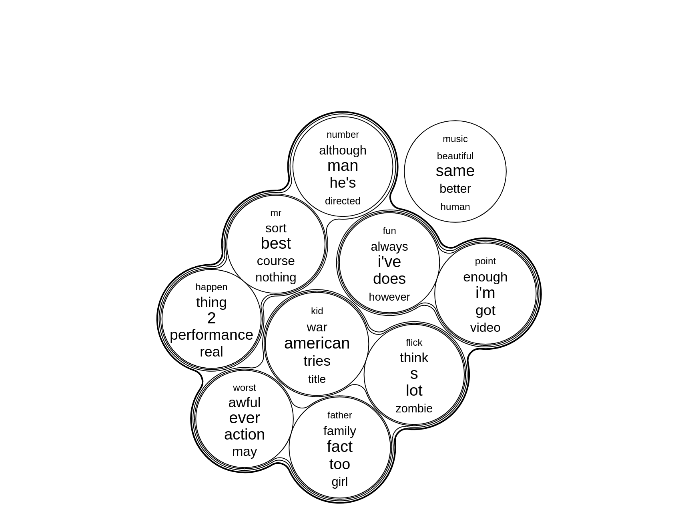

# bubbletree

Generate bubbletreemaps in order to visualize hierarchically clustered data, e.g. topics of a topic model, documents of a corpus, participant response profiles of a survey, etc.

## install

```
remotes::install_github("tilltnet/bubbletree")
```

## examples




